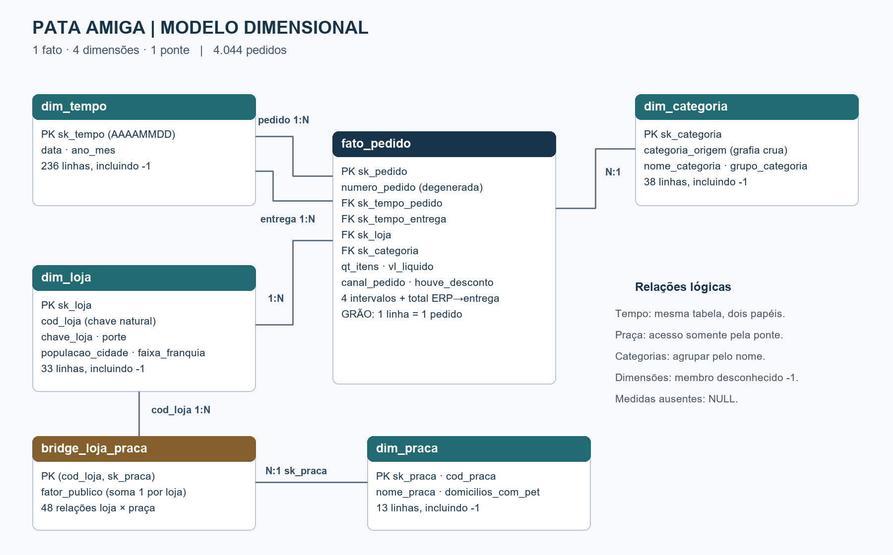

# Pata Amiga · Mini Projeto SCTEC

Modelo dimensional para analisar 4.044 pedidos de uma rede de 32 pet shops de Santa Catarina, entre **01/09/2023 e 31/03/2024**. O objetivo é localizar o gargalo logístico, entender a composição do faturamento e orientar um estudo de expansão.

**Autor:** Victor Hugo de Castro Brandão  
**Curso:** SCTEC · Módulo 2

**Validação:** executei as cargas 01 a 04, as consultas 05 e as verificações 06 no PostgreSQL 18.4 (Windows, 64 bits). Confirmei 4.044 pedidos distintos, a integridade das referências e a reconciliação exata de R$ 1.793.308,51. A exibição dos acentos foi verificada no pgAdmin. O material do curso utiliza PostgreSQL 16 como referência; os testes deste projeto foram realizados na versão 18.4. Veja [as evidências de validação](docs/VALIDACAO.md).

## Como reproduzir do zero

Referência do curso: PostgreSQL 16. Ambiente efetivamente validado: PostgreSQL 18.4 e cliente `psql`, com usuário autorizado a criar banco. Os scripts são UTF-8. Abra o terminal na raiz do projeto.

**O arquivo 01 original apaga e recria `dw_pata_amiga`. Execute em ambiente de estudo, depois de preservar qualquer banco anterior com esse nome.** Os scripts 03 e 04 são cargas iniciais: não os execute duas vezes sobre tabelas já preenchidas.

No PowerShell, configure UTF-8 antes da carga. Essa configuração evita que o cliente interprete os arquivos como WIN1252. O pgAdmin foi usado para confirmar a exibição correta dos acentos.

```powershell
chcp 65001
[Console]::OutputEncoding = [System.Text.Encoding]::UTF8
$env:PGCLIENTENCODING = "UTF8"
```

```powershell
psql -X -U postgres -d postgres -v ON_ERROR_STOP=1 -f sql/01-carga-staging.sql
psql -X -U postgres -d dw_pata_amiga -v ON_ERROR_STOP=1 -f sql/02-dimensoes-prontas.sql
psql -X -U postgres -d dw_pata_amiga -v ON_ERROR_STOP=1 -f sql/03-dimensoes.sql
psql -X -U postgres -d dw_pata_amiga -v ON_ERROR_STOP=1 -f sql/04-fato.sql
psql -X -U postgres -d dw_pata_amiga -v ON_ERROR_STOP=1 -f sql/05-perguntas.sql
psql -X -U postgres -d dw_pata_amiga -v ON_ERROR_STOP=1 -f sql/06-validacao-final.sql
```

Se `psql` não estiver no PATH, use o caminho completo do executável da instalação. 

### Windows: `psql` não reconhecido no PowerShell

Em algumas instalações do PostgreSQL no Windows, o comando `psql` pode não estar disponível diretamente no `PATH` do sistema. Nesse caso, utilize o caminho completo do executável.

Exemplo para PostgreSQL 18:

```powershell
& "C:\Program Files\PostgreSQL\18\bin\psql.exe" -X -U postgres -d postgres -v ON_ERROR_STOP=1 -f "sql/01-carga-staging.sql" 
```

A senha deve ser digitada no prompt local do `psql`. O arquivo 01 contém `\c`, um comando do cliente psql, e não deve ser colado inteiro no Query Tool do pgAdmin. No pgAdmin, após criar e carregar o banco pelo psql, é possível executar as consultas 02 a 06 no banco `dw_pata_amiga`.

Depois de **cada etapa**, rode somente o bloco correspondente de `sql/00-conferencia.sql`. O bloco “DEPOIS DO 02” espera tabelas vazias; executá-lo após o 04 não representa uma falha da carga. Os arquivos 00, 01, 02 e os três CSVs foram preservados byte a byte. O 01 já contém os INSERTs de toda a origem: não importe os CSVs novamente.

## Organização do trabalho

1. Ler o enunciado e registrar os controles da origem.
2. Preservar staging e as dimensões prontas.
3. Criar o de-para de categorias, praças e a ponte.
4. Carregar a fato sem perder ou duplicar pedidos.
5. Responder P1 a P5 e reconciliar os totais.
6. Documentar, revisar o diagrama e preparar a demonstração.

O histórico do projeto está publicado no [GitHub](https://github.com/victorhcbrandao/mini-projeto-sctec-pata-amiga), com branches e commits por etapa. O acesso público e a exibição do diagrama no README foram verificados. 

## Diagnóstico da origem

As três tabelas de staging contêm apenas texto e não foram alteradas. Os nomes de colunas da origem exigem aspas duplas por conterem espaços, pontuação e maiúsculas.

| Controle | Contagem |
| --- | ---: |
| stg_pedido | 4.044 |
| stg_loja | 32 |
| stg_loja_praca | 48 |
| Grafias distintas de nome de loja, incluindo vazio | 128 |
| Grafias não vazias de nome de loja | 127 |
| Grafias de categoria | 37 |
| Grafias de HouveDesconto, incluindo vazio | 17 |
| Grafias de CanalPedido, incluindo vazio | 20 |
| Pedidos sem código de loja | 1.575 (38,95%) |
| Pedidos sem nome de loja | 3 (0,07%) |
| Separação em branco | 1.077 |
| Nota fiscal em branco | 1.338 |
| Despacho em branco | 1.665 |
| Entrega em branco | 1.953 |

**stg_pedido:** nomes variam em caixa, acento, espaços, sufixo `/SC` e três grafias especiais. Categoria, desconto e canal têm sinônimos. Pedido e integração usam datas americanas com AM/PM; os marcos usam ISO. Dinheiro mistura decimal brasileiro e americano, símbolo R$, vazio e hífen. Itens também têm ausências. Não se deve resolver a loja apenas pelo código, ausente em aproximadamente 39% dos pedidos.

**stg_loja:** cadastro de 32 lojas, com população e área como texto e atributos da franquia que representam somente a foto atual. Não há datas de vigência nem versões anteriores que permitam recuperar a faixa histórica. A `dim_loja` entregue pelo professor já traz esse cadastro tratado, inclusive a chave normalizada.

**stg_loja_praca:** as 48 linhas representam combinações de loja e praça, não 48 praças. Existem 12 códigos de praça e 32 lojas. Nomes, regional e domicílios repetem-se consistentemente por código de praça. Domicílios usam ponto de milhar; o percentual de público é uma fração em texto. Uma soma direta após juntar a ponte duplicaria faturamento.

Marcos ausentes são preservados como ausência de etapa registrada. Entre os 1.953 sem data de entrega, há 872 retiradas na loja, 205 cancelados, 327 aguardando despacho, 261 aguardando nota e 288 em trânsito. Não é correto concluir que todos sejam atrasos logísticos.

## Modelo e decisões de tratamento



| Tabela | Grão | Linhas |
| --- | --- | ---: |
| fato_pedido | Um pedido | 4.044 |
| dim_tempo | Uma data, mais membro -1 | 236 |
| dim_loja | Uma loja, mais membro -1 | 33 |
| dim_categoria | Uma grafia crua, mais membro -1 | 38 |
| dim_praca | Uma praça, mais membro -1 | 13 |
| bridge_loja_praca | Uma combinação loja × praça | 48 |

As chaves substitutas são inteiras; `dim_tempo` usa a chave de data AAAAMMDD fornecida pelo professor. Todas as dimensões contêm `-1 = Nao Informado`. A fato mantém quatro referências obrigatórias: loja, categoria e dois papéis da mesma dimensão tempo. O DDL fornecido declara PKs, mas não constraints FOREIGN KEY; a integridade das referências é conferida por consultas. Não foram acrescentadas tabelas, views, funções, procedures, triggers, CTEs ou funções de janela.

O código `numero_pedido` é uma dimensão degenerada: identifica o pedido, sem justificar outra tabela. `houve_desconto` e `canal_pedido` ficam padronizados na fato porque não têm outros atributos associados. `qt_itens` e `vl_liquido` são medidas aditivas. Taxas e percentuais são calculados nas consultas, nunca armazenados na fato.

### Categorias

`categoria_origem` mantém a grafia exata, sem TRIM nem UPPER no valor gravado. O tratamento ocorre na comparação do CASE, com TRIM, TRANSLATE e UPPER. A fato faz igualdade pela grafia crua e encontra uma única linha.

| Prioridade | Contém | Nome | Grupo |
| --- | --- | --- | --- |
| 1 | MED | Medicamento | Saude e Higiene |
| 2 | PETISC | Petisco | Alimentacao |
| 3 | RA | Racao | Alimentacao |
| 4 | HIG | Higiene | Saude e Higiene |
| 5 | BRINQ | Brinquedo | Bem-estar |
| 6 | ACESS | Acessorio | Bem-estar |
| 7 | SERV | Servico | Bem-estar |
| Demais | — | Nao Informado | Nao Informado |

MED vem antes de RA para classificar “Ração Medicamentosa” como Medicamento. As 37 grafias presentes foram classificadas nas sete categorias previstas. O exemplo “Alimento Seco” citado na contextualização não aparece no CSV fornecido; o CASE segue o de-para prescrito para os dados recebidos.

### Loja, praça e ponte

O nome é normalizado no ON, antes do lookup: remoção de acento, caixa alta, retirada de `/SC`, espaço duplo e espaços nas pontas. O CASE corrige BLUMENAL CENTRO → BLUMENAU CENTRO, FLORIPA NORTE → FLORIANOPOLIS NORTE e JGUA DO SUL → JARAGUA DO SUL. O LEFT JOIN conserva os três pedidos sem nome e atribui -1.

A praça é agrupada por `CodPraca`. MAX recupera atributos constantes por praça; o ponto de milhar de domicílios é retirado antes do CAST. A ponte liga `dim_loja.cod_loja` a `dim_praca.sk_praca`. Seus fatores somam exatamente 1 por loja. Não existe ligação direta da praça com a fato.

### Datas, números e domínios

Pedido e integração usam `TO_TIMESTAMP(..., 'MM/DD/YYYY HH12:MI AM')`; os quatro marcos ISO são convertidos para DATE. As chaves temporais usam `TO_CHAR(..., 'YYYYMMDD')`. A entrega sem data recebe chave -1. Os cinco intervalos são calculados uma única vez: quatro etapas consecutivas e o total **integração ERP → entrega**, em dias de calendário. A parte horária é descartada conforme o enunciado. Ausência de etapa vira NULL, e um intervalo realizado no mesmo dia pode ser zero.

Vazio e hífen em itens e valor líquido viram NULL. Valores com vírgula perdem o ponto de milhar e trocam a vírgula por ponto; valores decimais americanos são preservados. O CASE monetário segue a expressão fornecida no PDF. Ela não diferencia `1.200` como milhar de `1.200` como decimal quando não há vírgula: esse formato ambíguo não ocorre no valor líquido do arquivo recebido. Para dados futuros, essa regra precisaria de definição explícita da origem.

Desconto: S/SIM/1/X/TRUE/V → Sim; N/NAO/0/FALSE/F → Nao; demais → Nao Informado. Canal testa WHATS antes de APP, depois SITE, LOJA e TEL. Isso conserva **414 pedidos de WhatsApp**. São 198 pedidos com desconto não informado e 237 com canal não informado; esses grupos permanecem visíveis.

## Respostas às perguntas de negócio

As tabelas abaixo apresentam os resultados das consultas executadas no PostgreSQL. Os nomes dos blocos em `sql/05-perguntas.sql` permitem reproduzir cada resultado. [Resultados completos](resultados/RESULTADOS.md) incluem as 32 lojas e todos os cruzamentos.

### P1 · Onde está o gargalo?

O total médio entre integração ERP e entrega é **9,00 dias**, considerando 2.091 entregas com data. O maior intervalo da rede é **nota → despacho: 4,11 dias**. Os demais são integração → separação, 2,13; separação → nota, 0,64; despacho → entrega, 2,14 dias.

| porte | pedidos | integracao_separacao | separacao_nota | nota_despacho | despacho_entrega | total_erp_entrega | entregas_concluidas |
| --- | --- | --- | --- | --- | --- | --- | --- |
| Grande | 1.763 | 1,96 | 0,64 | 3,32 | 2,01 | 7,93 | 903 |
| Media | 1.663 | 1,98 | 0,62 | 3,34 | 2,03 | 7,95 | 880 |
| Nao Informado | 3 | 2,00 | 0,00 | 4,00 | 3,00 | 8,50 | 2 |
| Pequena | 615 | 3,02 | 0,69 | 8,53 | 2,86 | 15,16 | 306 |

O gargalo é nota → despacho nos três portes. Nas pequenas chega a **8,53 dias**, ante 3,32 nas grandes e 3,34 nas médias. Prioridade operacional: investigar a fila de expedição, a frequência de coleta e a capacidade de despacho das lojas pequenas. As médias das etapas usam populações diferentes, pois AVG ignora NULL; somá-las não precisa reproduzir a média do total. Os 48,29% sem entrega registrada limitam a leitura do prazo e podem introduzir viés de observação.

### P2 · Qual categoria concentra o faturamento?

**Ração concentra R$ 1.076.202,55, ou 60,01% do total.**

| nome_categoria | faturamento | percentual_rede |
| --- | --- | --- |
| Racao | 1.076.202,55 | 60,01 |
| Medicamento | 305.904,03 | 17,06 |
| Petisco | 128.590,16 | 7,17 |
| Servico | 94.001,37 | 5,24 |
| Higiene | 92.314,45 | 5,15 |
| Acessorio | 64.661,39 | 3,61 |
| Brinquedo | 31.634,56 | 1,76 |

A categoria campeã é Ração em todos os três portes:

| porte | nome_categoria | faturamento |
| --- | --- | --- |
| Grande | Racao | 468.186,60 |
| Media | Racao | 443.131,62 |
| Pequena | Racao | 164.197,55 |

A soma das categorias é **R$ 1.793.308,51**, igual ao total da fato e ao valor líquido conhecido da origem. O grupo desconhecido de loja permanece incluído no total. Classificar Ração Medicamentosa como ração inflaria indevidamente a categoria líder.

### P3 · O desconto funciona igual em todo canal?

| Canal | Ticket com desconto (R$) | Ticket sem desconto (R$) | Faturamento (R$) | % da rede |
| --- | --- | --- | --- | --- |
| App | 488,04 | 167,63 | 552.134,43 | 30,79 |
| Site | 501,92 | 189,68 | 450.569,37 | 25,13 |
| Loja Fisica | 494,04 | 197,55 | 360.677,22 | 20,11 |
| WhatsApp | 514,33 | 179,26 | 188.678,63 | 10,52 |
| Telefone | 514,02 | 195,23 | 123.419,29 | 6,88 |
| Nao Informado | 561,59 | 206,95 | 117.829,57 | 6,57 |

O ticket observado com desconto é maior em todos os cinco canais identificados. Não há, nesta amostra, canal em que o grupo com desconto apresente ticket menor. A intensidade da diferença varia: no App são R$ 320,41 e no WhatsApp R$ 335,07. Os totais por canal incluem o grupo de desconto não informado; as comparações Sim/Não não o misturam com nenhum dos dois.

Essas diferenças **não provam efeito causal do desconto**. Pedidos maiores podem receber desconto com mais frequência; categoria, quantidade e perfil do comprador também diferem. O modelo não inclui custo ou margem, portanto ticket maior não demonstra rentabilidade maior. Recomendo comparar mix e quantidades e testar políticas por canal com desenho controlado antes de ampliar descontos. AVG usa somente pedidos com valor conhecido; os tamanhos desses grupos estão nos resultados completos.

### P4 · Qual praça concentra o faturamento?

| cod_praca | nome_praca | domicilios_com_pet | faturamento_rateado | percentual_rede | percentual_domicilios | reais_por_domicilio |
| --- | --- | --- | --- | --- | --- | --- |
| PRC01 | Vale do Itajai | 148.000 | 633.746,09 | 35,34 | 17,29 | 4,28 |
| PRC05 | Grande Florianopolis | 132.000 | 283.546,75 | 15,81 | 15,42 | 2,15 |
| PRC02 | Norte Industrial | 96.000 | 175.431,90 | 9,78 | 11,21 | 1,83 |
| PRC06 | Litoral Sul | 58.000 | 137.051,20 | 7,64 | 6,78 | 2,36 |
| PRC03 | Litoral Norte | 61.000 | 128.872,75 | 7,19 | 7,13 | 2,11 |
| PRC11 | Extremo Oeste | 63.000 | 98.359,18 | 5,48 | 7,36 | 1,56 |
| PRC07 | Carbonifera | 67.000 | 88.707,42 | 4,95 | 7,83 | 1,32 |
| PRC08 | Serra Catarinense | 44.000 | 80.477,64 | 4,49 | 5,14 | 1,83 |
| PRC10 | Meio-Oeste | 51.000 | 58.955,63 | 3,29 | 5,96 | 1,16 |
| PRC04 | Foz do Itajai | 74.000 | 46.749,72 | 2,61 | 8,64 | 0,63 |
| PRC12 | Planalto Norte | 33.000 | 31.100,84 | 1,73 | 3,86 | 0,94 |
| PRC09 | Planalto Serrano | 29.000 | 29.323,10 | 1,64 | 3,39 | 1,01 |

**Vale do Itajaí lidera com R$ 633.746,09 rateados:** 35,34% do faturamento da rede para 17,29% dos domicílios com pet das praças cadastradas. Sua participação no faturamento é aproximadamente 2,04 vezes a participação nos domicílios. São R$ 4,28 por domicílio no período. Isso sinaliza concentração da operação; não representa gasto total do mercado nem prova demanda não atendida.

O faturamento é multiplicado pelo fator de público antes da soma. O denominador de domicílios é a dimensão de praças, sem repetir domicílios a cada pedido. A reconciliação exata é:

**R$ 1.792.322,21 rateados + R$ 986,30 sem loja/praça = R$ 1.793.308,51. Diferença: R$ 0,00.**

Os três pedidos sem loja são demonstrados separadamente, pois não há base para atribuir praça. A soma das linhas arredondadas a centavos pode diferir em R$ 0,01; a reconciliação usa os valores integrais e arredonda só a diferença final. O rateio é uma alocação pelo público cadastrado, não identificação do endereço efetivo de cada venda.

### P5 · Onde abrir a próxima loja e o que não se pode afirmar?

#### a) Ranking por mil habitantes e recomendação

Fórmula: `1000.0 * SUM(qt_itens) / populacao_cidade`. O numerador é a quantidade conhecida dos pedidos, conforme a métrica pedida. Não houve subtração de devoluções ou cancelamentos, que não fazem parte da fato especificada.

| cidade | itens | populacao_cidade | itens_por_mil_habitantes | dias_entrega | pedidos | entregas_concluidas |
| --- | --- | --- | --- | --- | --- | --- |
| Rio dos Cedros | 474 | 11.322 | 41,87 | 14,24 | 61 | 29 |
| Presidente Getúlio | 570 | 16.359 | 34,84 | 14,16 | 88 | 43 |
| Ibirama | 597 | 18.613 | 32,07 | 15,39 | 98 | 54 |
| Itapoá | 534 | 20.586 | 25,94 | 15,39 | 84 | 36 |
| Santo Amaro da Imperatriz | 530 | 22.357 | 23,71 | 15,88 | 85 | 50 |
| Taió | 352 | 18.173 | 19,37 | 14,57 | 59 | 30 |
| Timbó | 804 | 45.011 | 17,86 | 7,70 | 123 | 60 |
| Gaspar | 1.189 | 71.133 | 16,72 | 8,01 | 181 | 96 |
| Otacílio Costa | 289 | 18.227 | 15,86 | 15,61 | 44 | 18 |
| Ituporanga | 354 | 25.748 | 13,75 | 16,53 | 51 | 19 |

**Recomendo priorizar Rio dos Cedros para um estudo de viabilidade de uma nova unidade ou reforço de atendimento.** A cidade lidera com 41,87 itens por mil habitantes e tem 14,24 dias de prazo médio, acima dos 9,00 da rede. Presidente Getúlio (34,84; 14,16 dias) e Ibirama (32,07; 15,39 dias) são alternativas próximas no ranking. Há evidência de atividade relativa elevada e serviço lento, mas não de retorno financeiro garantido.

O próximo passo acionável é medir a fila de despacho da unidade atual de Rio dos Cedros, testar aumento de frequência de coleta e comparar o custo desse reforço com uma nova unidade. Antes de aprovar abertura, levantar concorrência, aluguel, margem, capacidade, endereços dos clientes e possível canibalização da loja existente. Apenas 29 dos 61 pedidos de Rio dos Cedros têm entrega registrada, e a taxa usa 474 itens conhecidos em 59 pedidos. População pequena eleva a taxa; os pedidos atendem múltiplas praças, então não se pode assumir que todos os compradores moram na cidade da loja. O ranking é indicador comparativo, não penetração populacional exata.

#### b) Faixa de franquia atual

| faixa_franquia | pedidos | faturamento | percentual_rede |
| --- | --- | --- | --- |
| Ouro | 2.316 | 1.011.264,38 | 56,39 |
| Diamante | 818 | 382.209,74 | 21,31 |
| Prata | 719 | 314.812,03 | 17,55 |
| Bronze | 188 | 84.036,06 | 4,69 |
| Nao Informado | 3 | 986,30 | 0,05 |

As lojas **atualmente Ouro** respondem por **R$ 1.011.264,38 (56,39%)**. Isso não responde quanto veio de lojas que já eram Ouro na data do pedido: o cadastro sobrescreveu o passado. Para responder historicamente, seria preciso obter versões anteriores e datas de vigência e, em evolução futura, usar uma dimensão com histórico (SCD tipo 2). Não é possível reconstruir mudanças ausentes pela simples existência da data do pedido.

#### c) O que ficou sem informação

| pedidos | sem_loja | sem_entrega | sem_itens | sem_valor | percentual_sem_entrega | percentual_sem_itens | percentual_sem_valor |
| --- | --- | --- | --- | --- | --- | --- | --- |
| 4.044 | 3 | 1.953 | 257 | 121 | 48,29 | 6,36 | 2,99 |

Os 3 pedidos sem loja são 0,07% dos pedidos e R$ 986,30 de valor conhecido. Os 1.953 sem entrega registrada são 48,29%; 257 sem itens, 6,36%; 121 sem valor líquido, 2,99%. Em itens são 187 vazios e 70 hífens; em valor líquido, 95 vazios e 26 hífens. Os grupos podem se sobrepor e não devem ser somados como pedidos distintos. Os 121 valores ausentes não viram zero e não permitem quantificar o faturamento faltante. A receita calculada é a soma conhecida do campo solicitado, sem inferir recebimento contábil ou status de pagamento.

## Validação e apresentação

O total arredondado é **R$ 1.793.309**, igual ao controle do enunciado. O diagrama mostra os dois papéis do tempo e o caminho indireto por praça. A carga da fato utiliza um único INSERT SELECT e mantém uma linha por pedido. Os testes e suas evidências estão em [VALIDACAO.md](docs/VALIDACAO.md).

- **Repositório:** [mini-projeto-sctec-pata-amiga](https://github.com/victorhcbrandao/mini-projeto-sctec-pata-amiga), público e com acesso verificado sem login.
